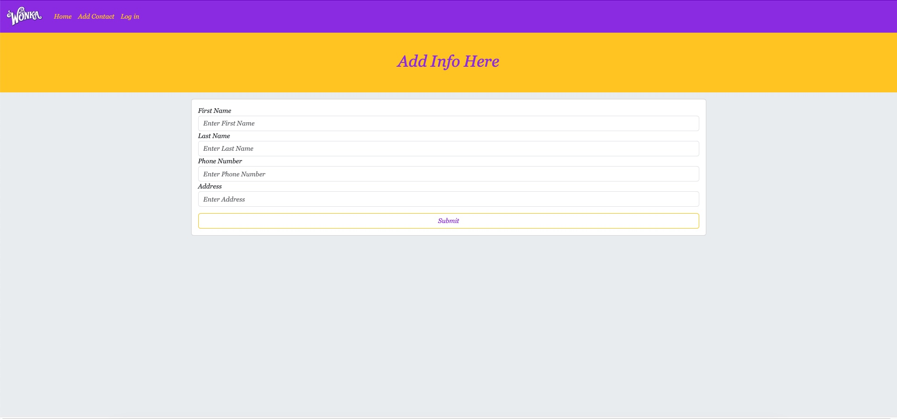

## :loop: Day 2 - Flask Database :loop:

This assignment was for practice creating a flask database with a working form to submit. We used SQL Alchemy and SQL Migrate for the database handling. This assignment was a little fustrating because there were a lot of components that I had to keep track of. Even so, I was able to get this flask application to work the way I wanted it to. I liked this project because it was a refresher of what we learned in lecture and it gave me a deeper understanding of the different components that have to be used.

## :one::zero: Day 3 - Flask Login :zero::one:

For Day 3's homework we had to add Login capabilities and Authentication with the Flask-Login package. This was pretty cool because I got to enhance my knowledge of Routeing, Database Relationships, creating databases, and Creating forms that will then be migrated to our database via the Flask-Migrate packages. I also got some practice with the database querying to only show the added contacts of the currently logged in user. Then I got the chance to get a little more creative and push the narrative of the site a little further.

This is the toolbar when I am Logged In. ⬇️

This is the toolbar when I am Logged Out. Along with the Flash messages from the Flask-Flash package. ⬇️

This is the newly created view contacts page that only shows contacts added by the current user logged in. ⬇️

## :zero::one:Day 4 - Weekend:one::zero:

From Day 4 I was tasked with a weekend assignment to make all of my routes to GET info, PUT info changes into the database, POST new content to the database, and DELETE data from the database through Flask Blueprint Routes using Postman software.

This is the Edit and Delete Buttons ⬇️

This is the Edit Form with pre-existing data already filled in. ⬇️

